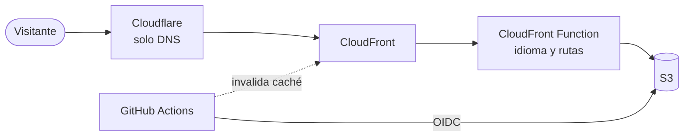

<div align="center">

# Daniel Martín Hurtado · Portfolio

**Mi carta de presentación en la web: proyectos, experiencia y quién soy.**

[](https://danimh.dev)
[](https://astro.build)
[](https://tailwindcss.com)
[](https://aws.amazon.com)


<br />

[**🌐 Ver la web**](https://danimh.dev) &nbsp;·&nbsp;
[Características](#-características) &nbsp;·&nbsp;
[Stack](#-stack) &nbsp;·&nbsp;
[Puesta en marcha](#-puesta-en-marcha) &nbsp;·&nbsp;
[Despliegue](#-despliegue) &nbsp;·&nbsp;
[Contacto](#-contacto)

<br />


</div>

## 👋 Sobre el proyecto

Portfolio personal de **Daniel Martín Hurtado**, estudiante de Ingeniería de Telecomunicaciones (especialidad Audio y Multimedia), apasionado por las redes, la telemática y **Python**.

Es una web estática, rápida y siempre en **modo oscuro**, disponible en **español e inglés**, pensada para cargar al instante y verse bien en cualquier dispositivo. Se despliega sola en AWS cada vez que subo cambios.

## ✨ Características

<table>
<tr>
<td width="50%" valign="top">

**🌍 Bilingüe**
- Español en [danimh.dev](https://danimh.dev) e inglés en [danimh.dev/en/](https://danimh.dev/en/).
- **Detección automática** del idioma en la portada.
- La elección manual con `ES | EN` se **recuerda un año**.

**🎬 Proyectos que se ven en acción**
- **Vídeo demo** en AV1 (1080p), con H.264 de reserva para dispositivos sin AV1.
- **Ventana de código** que se desplaza sola, solo con CSS, y se pausa al pasar el ratón.
- Enlaces a la web en vivo y al repositorio de cada proyecto.

**🎨 Diseño**
- **Fondo animado** con auroras y grano, que se detiene con *Reducir movimiento*.
- **Modo oscuro permanente**.
- **Responsive**, adaptado a la Dynamic Island y al notch del iPhone.

</td>
<td width="50%" valign="top">

**⚡ Rendimiento**
- **100 en PageSpeed Insights**, sin JavaScript de terceros.
- **Imágenes optimizadas** con `astro:assets` y `sharp`.
- Archivos con hash cacheados un año en CloudFront.

**🔍 SEO y accesibilidad**
- `lang`, enlaces `hreflang`, `og:locale` y sitemap con las dos versiones.
- **Open Graph** para que el enlace se vea bien al compartirlo.
- `aria-label` traducidos, textos alternativos y contraste AA en el código.

**📬 Contacto y extras**
- Correo (con asunto en el idioma de la página), LinkedIn y GitHub.
- **CV en PDF** descargable en cada idioma.
- **Página 404** propia en los dos idiomas.

</td>
</tr>
</table>

## 🧰 Stack

| Área            | Tecnología                                                                  |
| :-------------- | :-------------------------------------------------------------------------- |
| Framework       | [Astro](https://astro.build)                                                |
| Idiomas         | [i18n de Astro](https://docs.astro.build/en/guides/internationalization/) + diccionario propio |
| Estilos         | [Tailwind CSS 4](https://tailwindcss.com) y [Flowbite](https://flowbite.com) |
| Tipografía      | [Onest Variable](https://fontsource.org/fonts/onest)                        |
| Imágenes        | `astro:assets` + [sharp](https://sharp.pixelplumbing.com)                   |
| Código resaltado | Componente `<Code>` de Astro ([Shiki](https://shiki.style))                |
| Vídeo           | AV1 + H.264, codificado con [FFmpeg](https://ffmpeg.org)                    |
| SEO             | [@astrojs/sitemap](https://docs.astro.build/en/guides/integrations-guide/sitemap/) y `robots.txt` |
| Hosting         | AWS S3 + CloudFront + CloudFront Functions                                  |
| CI/CD           | GitHub Actions con autenticación OIDC (sin claves guardadas)                |
| Dominio y DNS   | [danimh.dev](https://danimh.dev), con DNS en Cloudflare                     |

## 📁 Estructura

```text
/
├── .github/workflows/          # Despliegue automático a AWS
├── infra/                      # CloudFront Function (no forma parte de la web)
├── public/
│   ├── videos/                 # Vídeos demo de los proyectos (AV1 + H.264)
│   └── ...                     # CV (es/en), favicon, imagen Open Graph y robots.txt
├── src/
│   ├── assets/
│   │   ├── code/               # Código de ejemplo que se muestra en los proyectos
│   │   └── ...                 # Imágenes optimizadas por Astro
│   ├── components/
│   │   ├── Home.astro          # ⭐ Toda la portada; la comparten las dos páginas
│   │   ├── Header.astro        # Menú y selector ES | EN
│   │   ├── Footer.astro
│   │   ├── Projects.astro      # Datos y tarjeta de los proyectos (vídeo + código)
│   │   ├── Experience.astro    # Datos de la experiencia en los dos idiomas
│   │   ├── ExperienceItems.astro
│   │   └── ...                 # SocialPill, SectionContainer, Badge
│   ├── i18n/
│   │   ├── ui.ts               # Diccionario de textos en español e inglés
│   │   └── utils.ts            # getLangFromUrl() y useTranslations()
│   ├── icons/                  # Iconos SVG como componentes
│   ├── layouts/                # Layout base (head, SEO, hreflang, fondo animado)
│   ├── pages/
│   │   ├── index.astro         # danimh.dev/     → <Home /> en español
│   │   ├── en/index.astro      # danimh.dev/en/  → <Home /> en inglés
│   │   └── 404.astro           # Página de error
│   └── styles/                 # Tailwind, Flowbite, colores y animaciones propias
├── .gitattributes              # Excluye src/assets/code de las estadísticas de GitHub
└── astro.config.mjs            # Idiomas, sitemap y Tailwind
```

## 🎬 Proyectos

Cada proyecto es un objeto dentro de `PROJECTS` en [Projects.astro](src/components/Projects.astro). La tarjeta muestra el texto y las tecnologías arriba y, debajo, el vídeo y una ventana con código que se desplaza sola.

| Campo | Para qué sirve |
| :---- | :------------- |
| `title`, `description` | Título y descripción (`{ es, en }`) |
| `link`, `github` | Web en vivo y repositorio |
| `image` | Captura; se usa si no hay vídeo |
| `video` | `{ av1, mp4 }`: el navegador elige AV1 y, si no lo soporta, H.264 |
| `poster` | Imagen mientras carga el vídeo (generada con `getImage`) |
| `icon`, `color` | Logo y color del título |
| `tags` | Tecnologías, definidas en `TAGS` |
| `code` | `{ file, lang, text }`: el código de la ventana animada |

<details>
<summary><b>Cómo se generan los vídeos</b></summary>

<br />

A partir de una grabación en alta resolución, se recorta a 30 fps y 1080p, sin audio:

```sh
# AV1 (versión principal)
ffmpeg -i master.mp4 -vf "fps=30,scale=1920:-2:flags=lanczos" -an \
  -c:v libsvtav1 -preset 4 -crf 40 -g 240 -pix_fmt yuv420p \
  -svtav1-params tune=0 -movflags +faststart demo.av1.mp4

# H.264 (reserva para dispositivos sin AV1)
ffmpeg -i master.mp4 -vf "fps=30,scale=1280:-2:flags=lanczos" -an \
  -c:v libx264 -preset veryslow -tune animation -b:v 640k \
  -pix_fmt yuv420p -movflags +faststart demo.mp4
```

Con un peso parecido (~3 MB), AV1 a 1080p obtiene un VMAF de 98 frente a 91 de H.264.

</details>

> [!NOTE]
> En iPhone con **modo ahorro de batería**, iOS no reproduce vídeos automáticamente: se muestra el póster con el botón de play. Es una decisión del sistema y la web la respeta.

## 🌍 Idiomas

Las dos páginas (`pages/index.astro` y `pages/en/index.astro`) muestran el mismo componente `Home.astro`. Cada componente averigua el idioma a partir de la URL (`Astro.url`), así que nadie tiene que pasárselo.

| Tipo | Ejemplo | Dónde se guarda |
| :--- | :------ | :-------------- |
| Textos de la interfaz | Menú, títulos de sección, botones | [src/i18n/ui.ts](src/i18n/ui.ts), y se usan con `t("clave")` |
| Contenido | Descripción de un proyecto o de una experiencia | Junto a sus datos, como `{ es: "...", en: "..." }` |

```astro
---
import { getLangFromUrl, useTranslations } from "../i18n/utils";

const lang = getLangFromUrl(Astro.url);
const t = useTranslations(lang);
---

<h2>{t("section.projects")}</h2>
<p set:html={t("hero.description")} /> <!-- para textos con HTML, como <strong> o <span> -->
```

<details>
<summary><b>Añadir un texto nuevo</b></summary>

<br />

1. Añade la clave en `es` y en `en` dentro de [ui.ts](src/i18n/ui.ts).
2. Úsala con `{t("mi.clave")}`. Si falta la traducción al inglés, se muestra la española.

</details>

<details>
<summary><b>Añadir un idioma nuevo</b></summary>

<br />

1. Añade el código en `locales` de [astro.config.mjs](astro.config.mjs).
2. Añade el idioma en `languages` y sus textos en `ui` dentro de [ui.ts](src/i18n/ui.ts). El selector de la cabecera lo muestra automáticamente.
3. Crea `src/pages/<código>/index.astro` con `<Home />`.
4. Añade su versión en los datos de proyectos y experiencia.

</details>

<details>
<summary><b>Detección automática del idioma</b></summary>

<br />

Se hace en una **CloudFront Function** (evento *Viewer Request*), antes de servir la página. Así no hay parpadeo ni JavaScript extra en el navegador:

- Solo se aplica a la portada (`/`). Los enlaces directos a `/en/` o `/` se respetan siempre.
- Si existe la cookie `lang`, se respeta lo que el visitante eligió.
- Si no, se mira la cabecera `Accept-Language`: si el idioma preferido es español, o si la cabecera no viene (como pasa con el buscador de Google), se queda en español. Con cualquier otro idioma, se redirige a `/en/` con un **302**.
- Al pulsar `ES` o `EN`, un pequeño script del [Header](src/components/Header.astro) guarda la cookie `lang` durante un año.

La misma función resuelve las rutas de las subcarpetas en S3: `/en/` sirve `/en/index.html`, y `/en` redirige a `/en/` con un 301.

El código está en [infra/cloudfront-function.js](infra/cloudfront-function.js). No forma parte de la web (no se publica ni lo descarga el navegador); es una copia de la función que está en AWS.

</details>

> [!WARNING]
> Cambiar [infra/cloudfront-function.js](infra/cloudfront-function.js) no actualiza CloudFront. Si lo modificas, pega el código en **CloudFront → Functions → `index-rewrite`** y vuelve a publicarla.

## 🚀 Puesta en marcha

Requiere **Node.js 22.12 o superior** y **pnpm**.

```sh
git clone https://github.com/eldanimh/WebPortfolioDaniMartin.git
cd WebPortfolioDaniMartin
pnpm install
pnpm dev
```

La web quedará disponible en `http://localhost:4321` (español) y `http://localhost:4321/en/` (inglés).

| Comando           | Acción                                     |
| :---------------- | :----------------------------------------- |
| `pnpm install`    | Instala las dependencias                   |
| `pnpm dev`        | Servidor de desarrollo en `localhost:4321` |
| `pnpm build`      | Genera la versión de producción en `dist/` |
| `pnpm preview`    | Previsualiza la build en local             |

> [!NOTE]
> En local no hay detección automática del idioma, porque esa parte solo existe en CloudFront. El selector `ES | EN` sí funciona.

## 🚢 Despliegue

Cada `push` a `main` ejecuta el workflow de [deploy.yml](.github/workflows/deploy.yml):

1. Instala dependencias y construye el sitio.
2. Se autentica en AWS mediante **OIDC**, sin secretos de larga duración.
3. Sube los archivos con hash (`_astro/`) a S3 con caché inmutable de un año.
4. Sube el resto con revalidación constante.
5. Invalida la caché de CloudFront para que los cambios se vean al momento.



> [!TIP]
> Los archivos de `public/` se publican tal cual en la URL. Usa nombres sin tildes, `ñ` ni espacios (por ejemplo, `daniel-martin-hurtado-cv-es.pdf`). macOS guarda las tildes de los nombres de archivo de otra forma, y la URL no encontraría el archivo.

## 📬 Contacto

<div align="center">

[](https://danimh.dev)
[](mailto:dani@danimh.dev)
[](https://www.linkedin.com/in/daniel-martin-hurtado/)
[](https://github.com/eldanimh)

</div>

## 📄 Licencia

El código de este proyecto se distribuye bajo la licencia [MIT](LICENSE).

El contenido personal (textos, fotografías, logotipos, vídeos y CV) **no** está cubierto por esta licencia y no se puede reutilizar sin mi permiso.

---

<div align="center">

Hecho con cariño y mucho café por **Daniel Martín Hurtado**

</div>
